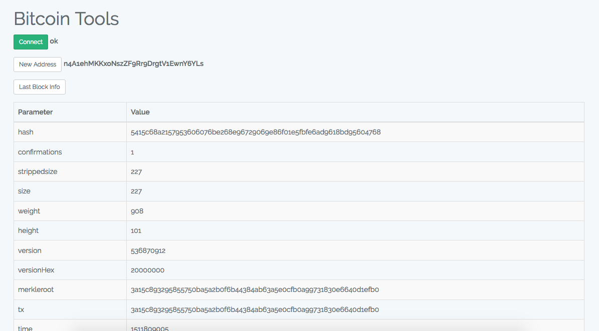

# Bitcoin Tools

## About
This laravel project help you to work with Bitcoin Core server.
It's use [laravel-bitcoinrpc](https://github.com/denpamusic/laravel-bitcoinrpc) project - Bitcoin JSON-RPC client powered by GuzzleHttp.

## Installation
Run 
```
git clone git@github.com:ivrm/btc.git
```

and run 
```
composer update
```


### Configure client
To connect to Bitcoin Core you'll need to add at least following parameters in .env file
```
BITCOIND_SCHEME=(scheme from bitcoin.conf)
BITCOIND_HOST=(host from bitcoin.conf)
BITCOIND_PORT=(port from bitcoin.conf)
BITCOIND_USER=(rpcuser from bitcoin.conf)
BITCOIND_PASSWORD=(rpcpassword from bitcoin.conf)
```

## Requirements
* PHP 7.0 or higher (should also work on 5.6, but this is unsupported)
* Laravel 5.1 or higher

## Usage
You can perform request to Bitcoin Core using buttons listed below:
- Connect to server
- Get new address
- Get last block

## Screenshots


## License

This product is distributed under MIT license.

